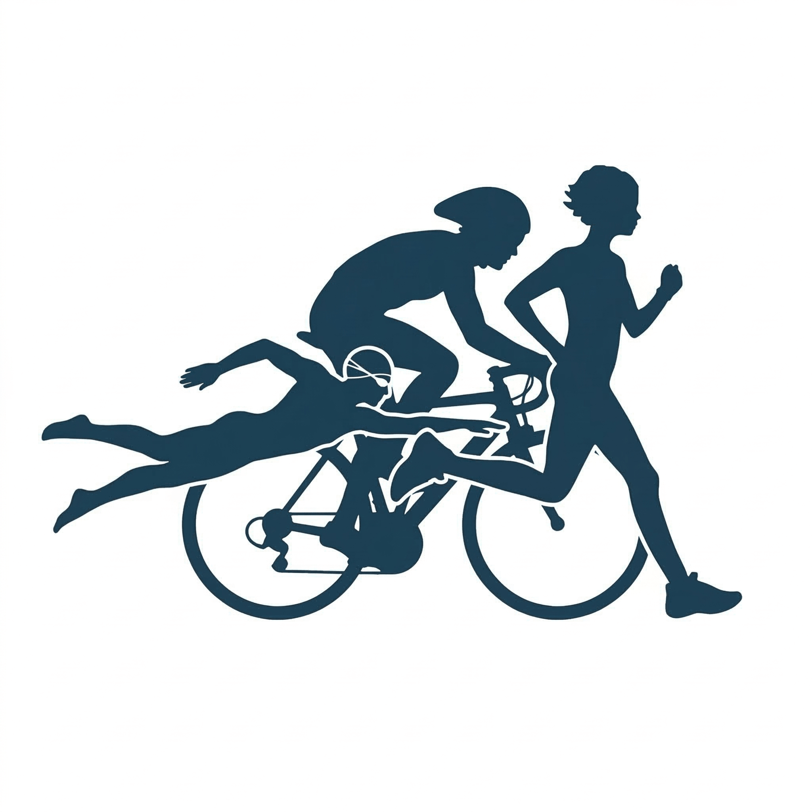

  
  
  # ProTraining
  *Plataforma de Gestión Deportiva Local para Atletas*

---

## 📌 Descripción del Proyecto
ProTraining es un sistema integral de gestión de entrenamiento desarrollado en Python/Django, diseñado para monitorizar el rendimiento en Trail Running, Ciclismo y Natación. La plataforma cruza datos de esfuerzo real con historiales clínicos (Ergometrías), evalúa la recuperación diaria y sincroniza reportes ligeros hacia Google Sheets para facilitar su consulta rápida lectura offline.

## 🚀 Características Principales
* **Dashboard Maestro:** Panel de control analítico con métricas semanales detalladas por deporte y un widget matutino de "Estado del Motor" (evaluación cruzada de sueño, estrés y FC de reposo).
* **Recálculo Clínico Dinámico:** Evalúa cada sesión de entrenamiento cruzando la Frecuencia Cardíaca Promedio con la Ergometría médica vigente en esa fecha exacta para clasificar el impacto real (Zonas 1 a 5).
* **Microservicio Cliente Móvil:** Sincronización automatizada con la API de Google Sheets para mantener resúmenes mensuales, históricos anuales y curva de evolución clínica en el celular.
* **Arquitectura Multideporte:** Soporte nativo para métricas específicas de carrera (desnivel, cadencia), ciclismo (velocidad, potencia) y natación (aguas abiertas, SWOLF).
* **Ejecución 100% Local:** Diseñado para correr de manera privada en Windows sin depender de servidores externos.

---

## 📖 Manual de Uso Operativo

### 1. Arranque del Sistema
El proyecto está configurado para levantar la infraestructura de forma automatizada sin necesidad de tipear comandos en la terminal.
1. Navegar a la carpeta raíz del proyecto (`ProTraining`).
2. Ejecutar el acceso directo **`iniciar_protraining.bat`** (recomendado tener un acceso directo en el Escritorio).
3. El script activará el entorno virtual, encenderá el servidor Django y abrirá automáticamente tu navegador predeterminado en `http://127.0.0.1:8000/`.

### 2. Sincronización Móvil (Google Sheets)
El ecosistema exporta las métricas de volumen para su acceso ligero mediante la app de Google Sheets en dispositivos móviles.
* **Actualización Automática:** El archivo `sync_sheets.py` debe estar configurado en el *Programador de Tareas* de Windows para ejecutarse diariamente (ej. 23:50 hs). 
* **Lógica de Sobreescritura:** Las pestañas *Run/Trail* y *Bicicleta* se limpian y recalculan mes a mes. La pestaña *Salud* funciona de manera evolutiva (agrega filas nuevas sin borrar las anteriores).
* **Seguridad:** Las credenciales de Google (`google_credentials.json`) y el script de sincronización están excluidos del control de versiones mediante `.gitignore`.

### 3. Carga de Datos y Zonas Cardíacas
* **Ingesta de Entrenamientos:** Las actividades de Running, Ciclismo y Natación se pueden cargar manualmente a través de los formularios o integrar directamente desde el dispositivo GPS.
* **Módulo Clínico (Ergometrías):** Para que el sistema clasifique correctamente el impacto aeróbico y anaeróbico, es vital mantener actualizados los estudios médicos. Al cargar un nuevo test de esfuerzo, el sistema actualizará los umbrales cardíacos para las actividades futuras, preservando el cálculo histórico de las actividades pasadas.

---
*Desarrollado y testeado en los cerros de Jujuy por Santiago Ezequiel Castillo*
